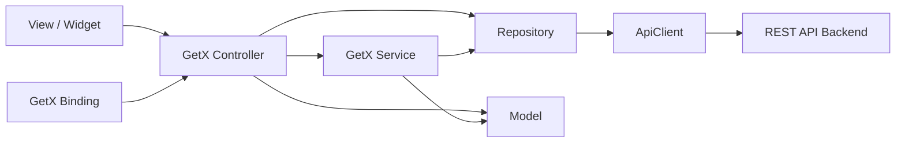

# Edushare

[](https://flutter.dev/)
[](https://dart.dev/)
[](https://pub.dev/packages/get)
[](https://github.com/FarlanTuruu/Aplikasi-Edushare/releases/latest)

Edushare adalah aplikasi Flutter untuk berbagi materi dan catatan perkuliahan. Aplikasi ini menyediakan pengelolaan catatan, catatan kolaboratif, speech-to-text, percakapan antarmahasiswa, profil, bookmark, serta pengunduhan materi. Data utama diperoleh dari REST API dan dikelola secara reaktif menggunakan GetX.

Proyek ini dikembangkan sebagai bagian dari mata kuliah Rekayasa Interaksi.

## Daftar isi

- [Fitur utama](#fitur-utama)
- [Arsitektur proyek](#arsitektur-proyek)
- [Struktur direktori](#struktur-direktori)
- [Stack teknologi](#stack-teknologi)
- [Integrasi backend](#integrasi-backend)
- [Persyaratan sistem](#persyaratan-sistem)
- [Instalasi dan menjalankan aplikasi](#instalasi-dan-menjalankan-aplikasi)
- [Pengujian dan quality check](#pengujian-dan-quality-check)
- [Build aplikasi](#build-aplikasi)
- [Catatan keamanan dan keterbatasan](#catatan-keamanan-dan-keterbatasan)
- [Tim pengembang](#tim-pengembang)

## Fitur utama

| Area | Kemampuan |
| --- | --- |
| Autentikasi | Registrasi, login, logout, lupa password, dan reset password berbasis token |
| Beranda | Feed materi publik, pencarian, akses detail materi, dan pembaruan data berkala |
| Catatan | Membuat, mengubah, menghapus, mengunggah file, menerbitkan, menjadwalkan, menyimpan sebagai draft, serta mengarsipkan catatan |
| Kolaborasi | Daftar, detail, pembuatan, pengubahan, dan penghapusan catatan kolaboratif |
| Speech-to-Text | Transkripsi suara langsung berbahasa Indonesia, unggah audio untuk transkripsi melalui backend, riwayat, detail, dan penghapusan transkripsi |
| Chat | Daftar room/direct message, membaca pesan, mengirim pesan, serta memilih gambar atau file |
| Profil | Melihat dan mengubah data profil beserta foto profil |
| Materi tersimpan | Menyimpan dan membatalkan penyimpanan catatan sebagai bookmark |
| File | Mengunduh materi, menampilkan progres, mendeteksi file yang sudah ada, dan membuka file dengan aplikasi perangkat |

## Arsitektur proyek

Edushare menggunakan arsitektur modular berbasis fitur yang mengikuti pola GetX/GetCLI. Setiap halaman umumnya terdiri dari `View`, `Controller`, dan `Binding`, sedangkan akses data dipisahkan ke `Service`, `Repository`, dan `ApiClient`.



Tanggung jawab setiap lapisan:

- **View** (`views/`) menyusun antarmuka dan mengamati state reaktif melalui `Obx`/GetX.
- **Controller** (`controllers/`) menangani state serta aksi khusus halaman, validasi input, navigasi, dan lifecycle.
- **Binding** (`bindings/`) mendaftarkan controller/dependensi secara lazy ketika route dibuka.
- **Service** (`lib/app/services/`) menyimpan state lintas halaman dan mengorkestrasi proses seperti autentikasi, notes, room, pesan, follow, dan download.
- **Repository** (`lib/app/data/*_repository.dart`) mendefinisikan operasi data per domain dan memetakan kebutuhan aplikasi ke endpoint backend.
- **ApiClient** (`lib/app/data/api_client.dart`) menyatukan base URL, header JSON, Bearer token, request HTTP, multipart upload, dan penanganan respons/error.
- **Model** (`lib/app/models/`) mengubah payload API menjadi objek Dart yang dipakai UI.
- **Routes** (`lib/app/routes/`) menjadi sumber route bernama dan menghubungkan route, view, serta binding.

### Alur aplikasi

1. `lib/main.dart` menginisialisasi Flutter dan mendaftarkan `AuthService`.
2. `GetMaterialApp` memuat daftar route dari `AppPages`; route awal adalah `/login`.
3. Saat route dibuka, GetX menjalankan binding untuk membuat controller yang diperlukan.
4. Controller menggunakan service atau repository untuk menjalankan proses bisnis.
5. Repository mengirim request melalui `ApiClient` ke REST API.
6. Respons dipetakan ke model/observable, lalu GetX memperbarui UI secara reaktif.

### Pola state dan dependency injection

- State halaman menggunakan `GetxController` dan tipe reaktif seperti `.obs`, `Rxn`, serta `RxList`.
- State lintas halaman menggunakan `GetxService`.
- Dependency injection menggunakan `Get.put`, `Get.lazyPut`, dan `Get.find`.
- Navigasi menggunakan named route melalui `Get.toNamed`, `Get.offAllNamed`, dan konfigurasi `GetPage`.

## Struktur direktori

```text
.
├── lib/
│   ├── main.dart                  # Entry point dan bootstrap AuthService
│   └── app/
│       ├── data/                  # ApiClient, konfigurasi, dan repository
│       ├── models/                # NoteModel dan MessageModel
│       ├── modules/               # Modul UI berbasis fitur
│       │   ├── auth/              # Login, register, forgot/reset password
│       │   ├── chat/              # Room dan pesan
│       │   ├── collaboration/     # CRUD catatan kolaboratif
│       │   ├── homepage/          # Feed dan detail materi
│       │   ├── notes/             # List, create, edit, detail, draft,
│       │   │                      # scheduled, dan archived
│       │   ├── settings/          # Profil dan catatan tersimpan
│       │   └── speech/            # Rekam, upload, list, detail, dan trash
│       ├── routes/                # Konstanta route dan daftar GetPage
│       └── services/              # State/proses lintas modul
├── assets/
│   ├── gambar/                    # Asset runtime yang terdaftar di pubspec
│   ├── High fidelity/             # Dokumentasi rancangan high-fidelity
│   └── Low fidelity/              # Dokumentasi rancangan low-fidelity
├── test/                          # Lokasi pengujian Flutter
├── android/                       # Konfigurasi platform Android
├── ios/                           # Konfigurasi platform iOS
├── web/                           # Bootstrap dan manifest web
├── windows/                       # Runner Windows
├── linux/                         # Runner Linux
├── macos/                         # Runner macOS
├── pubspec.yaml                   # Dependensi, versi aplikasi, dan asset
└── analysis_options.yaml          # Flutter lints dan pengecualian analyzer
```

> Hanya `assets/gambar/` yang terdaftar sebagai asset runtime di `pubspec.yaml`. Folder fidelity digunakan sebagai referensi desain dan tidak otomatis dibundel ke aplikasi.

## Stack teknologi

### Fondasi aplikasi

| Teknologi | Versi proyek | Fungsi |
| --- | --- | --- |
| Flutter | Stable; lockfile membutuhkan `>=3.44.0` | Framework UI lintas platform |
| Dart | `^3.8.1`; lockfile membutuhkan `>=3.12.0 <4.0.0` | Bahasa pemrograman |
| GetX | `^4.7.2` | State management, routing, dan dependency injection |
| GetCLI | Pola struktur proyek | Konvensi pemisahan module/view/controller/binding |

### Jaringan dan data

| Package | Versi | Fungsi |
| --- | --- | --- |
| `http` | `^1.1.0` | Request REST JSON dan multipart pada `ApiClient` |
| `dio` | `^5.4.0` | Download file dan pelaporan progres |
| `intl` | `^0.18.1` | Parsing dan format tanggal catatan |

### Media dan integrasi perangkat

| Package | Versi | Fungsi |
| --- | --- | --- |
| `speech_to_text` | `^7.3.0` | Speech recognition langsung dari mikrofon |
| `file_picker` | `^8.0.0` | Memilih dokumen atau audio |
| `image_picker` | `^1.1.2` | Memilih gambar untuk chat dan profil |
| `just_audio` | `^0.9.34` | Memutar serta memeriksa audio |
| `pdfx` | `^2.6.0` | Menampilkan materi PDF |
| `share_plus` | `^12.0.1` | Membagikan hasil/file melalui share sheet |
| `open_file` | `^3.3.2` | Membuka file hasil download |
| `url_launcher` | `^6.3.0` | Membuka URL eksternal |
| `permission_handler` | `^12.0.1` | Meminta izin mikrofon dan storage/media |
| `path_provider` | `^2.1.2` | Menentukan direktori penyimpanan lokal |
| `device_info_plus` | `^10.1.0` | Menyesuaikan perilaku terhadap versi perangkat |
| `emoji_picker_flutter` | `^2.0.0` | Pemilih emoji pada percakapan |

## Integrasi backend

Repository ini berisi aplikasi klien Flutter. Backend tidak berada di repository ini. Secara default aplikasi mengarah ke:

```text
https://web-production-291d3.up.railway.app/api
```

Base URL didefinisikan di `lib/app/data/config.dart` dan dapat diganti tanpa mengubah source code menggunakan `--dart-define`:

```powershell
flutter run --dart-define=API_BASE_URL=https://example.com/api
```

Untuk build release:

```powershell
flutter build apk --release --dart-define=API_BASE_URL=https://example.com/api
```

Kontrak endpoint yang digunakan klien mencakup:

| Domain | Contoh endpoint |
| --- | --- |
| Auth | `login`, `register`, `logout`, `forgot-password`, `reset-password`, `user` |
| Profil | `profile` dan upload foto multipart |
| Notes | `notes`, `public/notes`, `notes/drafts`, `notes/scheduled`, `notes/archived`, publish/archive/save |
| Kolaborasi | `collaborations`, `public/collaborations` |
| Chat | `rooms`, `rooms/dm`, `rooms/{id}/messages` dengan fallback endpoint `conversations/...` |
| Follow | `follow/{userId}` |
| Speech | `speech` dan upload multipart ke `speech/transcribe` |
| Bookmark | `saved-notes` dan `notes/{id}/save` |

Request terautentikasi menggunakan header berikut:

```http
Authorization: Bearer <token>
Accept: application/json
```

## Persyaratan sistem

- Flutter SDK stable yang kompatibel dengan `pubspec.lock`.
- Dart SDK yang disertakan Flutter.
- Git.
- Android Studio/Android SDK untuk Android, atau toolchain platform lain sesuai target Flutter.
- Emulator atau perangkat fisik.
- Koneksi internet dan backend API yang dapat diakses.

Untuk Android, manifest saat ini mendeklarasikan akses internet, mikrofon, penyimpanan lama, serta media gambar/video/audio. Pastikan izin runtime disetujui agar speech-to-text, pemilihan file, dan download berfungsi.

## Instalasi dan menjalankan aplikasi

1. Clone repository dan masuk ke direktori proyek.

   ```powershell
   git clone https://github.com/FarlanTuruu/Aplikasi-Edushare.git
   Set-Location Aplikasi-Edushare
   ```

2. Pastikan instalasi Flutter siap digunakan.

   ```powershell
   flutter doctor
   ```

3. Instal dependensi sesuai lockfile.

   ```powershell
   flutter pub get
   ```

4. Lihat perangkat yang tersedia dan jalankan aplikasi.

   ```powershell
   flutter devices
   flutter run
   ```

5. Jika menggunakan backend berbeda, sertakan base URL saat menjalankan aplikasi.

   ```powershell
   flutter run --dart-define=API_BASE_URL=http://10.0.2.2:8000/api
   ```

`10.0.2.2` adalah alamat host machine dari Android Emulator. Untuk perangkat fisik, gunakan IP LAN komputer dan pastikan backend dapat diakses dari jaringan perangkat.

## Pengujian dan quality check

Jalankan pemeriksaan standar sebelum membuat pull request:

```powershell
dart format --output=none --set-exit-if-changed lib test
flutter analyze
flutter test
```

Saat ini `test/widget_test.dart` hanya berisi template test yang dinonaktifkan, sehingga belum ada automated test aktif yang melindungi alur bisnis. Prioritas test yang disarankan adalah:

- unit test untuk parsing model dan error handling `ApiClient`;
- controller/service test untuk auth, status notes, dan transkripsi;
- widget test untuk login, pembuatan catatan, serta kondisi loading/error;
- integration test untuk alur API dengan backend staging atau mock server.

## Build aplikasi

### Android APK

```powershell
flutter build apk --release --dart-define=API_BASE_URL=https://example.com/api
```

Output utama berada di `build/app/outputs/flutter-apk/app-release.apk`.

### Android App Bundle

```powershell
flutter build appbundle --release --dart-define=API_BASE_URL=https://example.com/api
```

### Web

```powershell
flutter build web --release --dart-define=API_BASE_URL=https://example.com/api
```

### Desktop

```powershell
flutter build windows --release
flutter build linux --release
flutter build macos --release
```

Ketersediaan build bergantung pada sistem operasi dan toolchain target. Walaupun runner Android, iOS, web, Windows, Linux, dan macOS tersedia, kemampuan yang bergantung pada permission atau plugin perangkat harus diuji per platform.

## Menambahkan modul baru

Gunakan struktur konsisten berikut agar fitur baru mudah dirawat:

```text
lib/app/modules/<fitur>/
├── bindings/
│   └── <fitur>_binding.dart
├── controllers/
│   └── <fitur>_controller.dart
└── views/
    └── <fitur>_view.dart
```

Kemudian:

1. tempatkan kontrak data eksternal di repository;
2. gunakan service bila state perlu dibagikan lintas halaman;
3. daftarkan controller melalui binding;
4. tambahkan konstanta route di `app_routes.dart`;
5. hubungkan route, view, dan binding di `app_pages.dart`;
6. tambahkan test untuk state sukses, kosong, loading, dan error.

## Catatan keamanan dan keterbatasan

- Bearer token saat ini hanya disimpan di memori proses. Pengguna perlu login kembali setelah aplikasi ditutup.
- Jangan menaruh API key atau secret di source code maupun `--dart-define`; nilai tersebut dapat diekstrak dari aplikasi hasil build. Operasi yang memerlukan secret, termasuk transkripsi file, harus tetap dijalankan backend.
- Jika persistensi login ditambahkan, gunakan secure storage platform dan sediakan mekanisme refresh/revoke token.
- Konfigurasi release Android saat ini masih menggunakan debug signing key. Siapkan release keystore sebelum publikasi ke Play Store.
- Application ID Android masih `com.example.appedushare`; ganti dengan identifier resmi sebelum distribusi produksi.
- Izin iOS/macOS untuk mikrofon, speech recognition, kamera, dan galeri perlu dikonfigurasi dan diverifikasi sebelum fitur terkait dirilis pada platform Apple.
- Backend default adalah deployment publik. Untuk pengembangan, arahkan aplikasi ke backend staging/lokal agar data produksi tidak terdampak.
- Repository belum menyertakan file `LICENSE`.

## Desain UI/UX

Dokumentasi low-fidelity dan high-fidelity tersedia di folder `assets/`. Prototipe Figma dapat dilihat melalui tautan berikut:

[Figma Edushare — Low/High Fidelity](https://www.figma.com/design/na1EaLJPPvhmvXlhZuR5YP/Desain-RI--2022-076--2022-080--2022-106-?node-id=8-2&t=XFGsTS0BRs7ZQsv0-1)

## Tim pengembang

| Nama | NIM | Kelas | Alias | Tanggung jawab |
| --- | --- | --- | --- | --- |
| Tegar Putra Gaori | 202210370311106 | C | Tegar04 | Notes, Settings |
| Nanda Adela Larasati Kuncoro | 202210370311080 | C | GlooMy03 | Speech, Chat |
| Muh Farlan | 202210370311106 | C | FarlanTuruu | Collaboration, Auth, Homepage |

## Statistik rilis

[](https://github.com/FarlanTuruu/Aplikasi-Edushare/releases)
[](https://github.com/FarlanTuruu/Aplikasi-Edushare/releases/latest)
[](https://github.com/FarlanTuruu/Aplikasi-Edushare/releases/latest)
[](https://github.com/FarlanTuruu/Aplikasi-Edushare/releases/latest)
